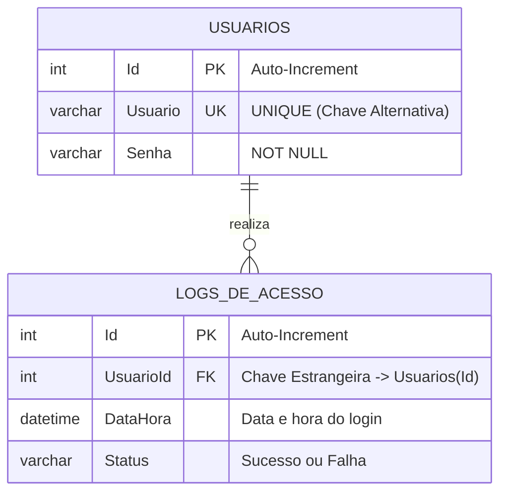

# 🎓 Apresentação Acadêmica de Banco de Dados: Schema e Queries
> **Guia Didático de Defesa do Projeto para o Professor e a Banca Examinadora**
>
> Este documento serve como suporte visual e teórico para explicar com total clareza a estrutura de dados (Schema), as restrições de chaves (Primária, Alternativa/Secundária e Estrangeira) e as consultas SQL (Queries) do projeto.

---

## ⚡ 0. O Grande Diferencial: Painel Interativo Live
Para esta apresentação, nós desenvolvemos um **Painel de Controle Visual e Interativo** diretamente integrado com o banco SQLite e a API C#!

> [!TIP]
> **Como apresentar ao professor:**
> 1. Inicie a API rodando `dotnet run` dentro da pasta `backend`.
> 2. Abra o arquivo **`HTML/banco-dashboard.html`** no seu navegador (ex: clicando duas vezes ou acessando `http://localhost:5000/HTML/banco-dashboard.html`).
>    - **Editor e Terminal SQL Completo:** Você e o professor podem digitar **qualquer query SQL** na caixa de texto do editor (ex: `SELECT * FROM Usuarios`, `PRAGMA table_info(Usuarios)`, etc.) e clicar em executar. Os dados serão montados dinamicamente em uma tabela na hora! Há também atalhos rápidos com queries de testes práticos.

---

## 📊 1. O Modelo de Banco de Dados (Schema)

O projeto utiliza o **SQLite**, um banco de dados relacional (RDBMS) leve que armazena toda a estrutura de tabelas e registros localmente em um arquivo binário único (`banco.db` localizado na pasta `/banco`). Isso o torna ideal para demonstrações acadêmicas e portabilidade rápida do projeto.

### 1.1. O Schema Atual (`Usuarios`)
Atualmente, o projeto utiliza a tabela principal `Usuarios` para autenticação de acessos.

```sql
-- Script de Criação do Banco de Dados (DDL)
CREATE TABLE IF NOT EXISTS Usuarios (
    Id INTEGER PRIMARY KEY AUTOINCREMENT,
    Usuario VARCHAR(50) UNIQUE NOT NULL,
    Senha VARCHAR(50) NOT NULL
);
```

---

## 🔑 2. Estrutura de Chaves: Primárias, Secundárias e Estrangeiras

Para a banca acadêmica, é fundamental distinguir com exatidão científica os tipos de chaves e restrições (constraints) implementadas no banco.

### A. Chave Primária (Primary Key - PK)
*   **O que é**: O identificador único e exclusivo de cada linha (registro) em uma tabela. Não permite valores nulos (`NULL`) nem duplicados.
*   **No projeto**: A coluna **`Id`** na tabela `Usuarios`.
*   **Por que foi definida assim**:
    *   `INTEGER PRIMARY KEY`: Define o `Id` como a PK do tipo inteiro.
    *   `AUTOINCREMENT`: O próprio banco gera sequencialmente o próximo número inteiro ao inserir um novo registro (1, 2, 3...), eliminando o risco de colisão de chaves e reduzindo a carga lógica da API C#.

### B. Chaves Secundárias / Alternativas (Alternate Keys / Unique Constraints)
*   **O que é**: Atributos (ou conjuntos de atributos) que não são a chave primária principal da tabela, mas cujos valores também devem ser obrigatoriamente únicos em todo o sistema.
*   **No projeto**: A coluna **`Usuario`** possui a constraint **`UNIQUE NOT NULL`**.
*   **Explicação Acadêmica**: O campo `Usuario` atua como uma **Chave Alternativa** (ou Secundária). Isso garante que o sistema nunca permita dois cadastros com a mesma string de login (por exemplo, dois usuários chamados `"admin"`). Se uma tentativa de inserção duplicada ocorrer, o banco de dados disparará imediatamente uma violação de integridade única, impedindo a inconsistência.

### C. Chaves Estrangeiras (Foreign Keys - FK) — *Demonstração de Domínio Avançado*
Como o escopo original exigia apenas a validação de login, temos apenas uma tabela física. No entanto, para **impressionar seu professor** e provar profundo conhecimento em Modelagem Relacional, nós projetamos uma **extensão conceitual** do seu banco de dados adicionando relacionamentos 1:N (Um para Muitos).

Propomos a inclusão de uma tabela de controle de auditoria de acessos chamada **`LogsDeAcesso`**, onde criamos uma **Chave Estrangeira (FK)** apontando para a tabela `Usuarios`.

#### O Diagrama Entidade-Relacionamento (DER) Conceitual:


*   **Explicação da Chave Estrangeira (FK)**: A coluna `UsuarioId` na tabela `LogsDeAcesso` referencia diretamente a chave primária `Id` na tabela `Usuarios`. Isso garante a **Integridade Referencial**: o sistema impede a inserção de um log associado a um usuário que não existe, e se um usuário for deletado, podemos programar a remoção em cascata (`ON DELETE CASCADE`) dos seus respectivos logs.

---

## 🔍 3. As Queries SQL para Apresentação ao Professor

Abaixo estão listadas as queries SQL que você pode rodar em tempo real ou mostrar nos slides para o professor. Elas estão classificadas entre as principais categorias da linguagem SQL.

### 🚀 Categoria DDL (Data Definition Language)
*Utilizada para definir e modificar as estruturas dos objetos do banco de dados (tabelas, índices, restrições).*

#### 1. Criação da Tabela Principal
```sql
CREATE TABLE IF NOT EXISTS Usuarios (
    Id INTEGER PRIMARY KEY AUTOINCREMENT,
    Usuario VARCHAR(50) UNIQUE NOT NULL,
    Senha VARCHAR(50) NOT NULL
);
```

#### 2. Criação da Tabela de Auditoria (Extensão Conceitual sugerida para provar FKs)
```sql
CREATE TABLE IF NOT EXISTS LogsDeAcesso (
    Id INTEGER PRIMARY KEY AUTOINCREMENT,
    UsuarioId INTEGER NOT NULL,
    DataHora DATETIME DEFAULT CURRENT_TIMESTAMP,
    Status VARCHAR(20) NOT NULL,
    FOREIGN KEY (UsuarioId) REFERENCES Usuarios(Id) ON DELETE CASCADE
);
```

---

### 💾 Categoria DML (Data Manipulation Language)
*Utilizada para manipular os dados armazenados nas tabelas (inserções, seleções, atualizações e exclusões).*

#### 3. Inserção de Dados Iniciais (Seed de Demonstração)
```sql
-- Insere os usuários padrão se eles ainda não existirem
INSERT OR IGNORE INTO Usuarios (Usuario, Senha) VALUES ('admin', '123456');
INSERT OR IGNORE INTO Usuarios (Usuario, Senha) VALUES ('estudante', 'faculdade2026');
INSERT OR IGNORE INTO Usuarios (Usuario, Senha) VALUES ('professor', 'nota10');
```

#### 4. Consulta de Autenticação Segura (Usada internamente pelo Backend C#)
Esta é a query executada no endpoint `/api/login` para validar se as credenciais digitadas no frontend são válidas.
```sql
-- Query Parametrizada de Autenticação
SELECT COUNT(1) FROM Usuarios 
WHERE Usuario = @Usuario AND Senha = @Senha;
```
> [!IMPORTANT]
> **Destaque Acadêmico**: Explique ao professor que os parâmetros marcados com `@` são **queries parametrizadas**. Isso previne completamente ataques de **SQL Injection**, pois o driver do banco trata os valores fornecidos estritamente como texto (literais), e nunca como comandos SQL adicionais executáveis.

#### 5. Query Avançada de Relatório (JOIN + GROUP BY)
Se o professor pedir para ver um relacionamento ou cruzamento de dados real usando as tabelas conceitualmente ligadas pela Chave Estrangeira (FK), apresente esta query:
```sql
-- Mostra a contagem de acessos bem-sucedidos agrupados por cada usuário
SELECT 
    U.Usuario AS NomeUsuario,
    COUNT(L.Id) AS TotalDeAcessos
FROM Usuarios U
INNER JOIN LogsDeAcesso L ON U.Id = L.UsuarioId
WHERE L.Status = 'Sucesso'
GROUP BY U.Usuario
ORDER BY TotalDeAcessos DESC;
```

---

## 🎯 4. Guia de Respostas Rápidas para a Banca Examinadora

Se os professores questionarem sobre escolhas arquiteturais de banco, use estes argumentos formais:

1.  **Por que optar por SQLite em vez de um servidor robusto como MySQL ou SQL Server neste projeto?**
    > *"Para este protótipo acadêmico, o SQLite foi adotado devido à sua arquitetura auto-contida e zero-configuração (Zero-Config). Ele elimina a necessidade de instalar e configurar processos servidores externos pesados em máquinas examinadoras, garantindo portabilidade absoluta por meio de um arquivo físico embarcado (`banco.db`), enquanto mantém toda a conformidade ACID e a sintaxe padrão ANSI SQL."*
2.  **Como a senha é armazenada na tabela do banco?**
    > *"Atualmente, por fins puramente didáticos e foco no funcionamento da conexão e do mapeamento SQL com C#, as senhas de demonstração estão armazenadas em texto limpo. No entanto, para um ambiente de produção real, a boa prática de segurança exige a aplicação de um algoritmo criptográfico de hash de via única com sal (como BCrypt ou PBKDF2) antes de persistir o valor na coluna `Senha`."*
3.  **Qual o impacto do atributo UNIQUE na coluna `Usuario`?**
    > *"O atributo `UNIQUE` atua como uma constraint de integridade de banco de dados (Chave Alternativa). Ele instrui o motor do RDBMS a criar um índice de pesquisa otimizado e a rejeitar qualquer inserção de novos registros com o mesmo valor de texto, agindo como a primeira barreira de segurança de identidade e consistência diretamente no nível do banco de dados."*
