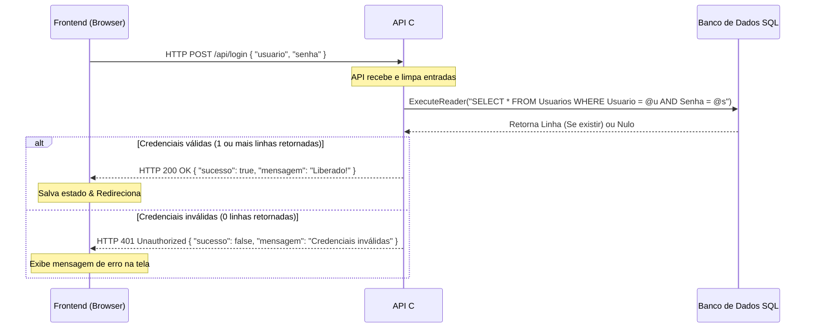

# Arquitetura Atual — API C# SQL para Login Universitário

## Status
Ativo — Definido para a entrega PRD-001.

## Stack
- **Frontend**: HTML5 / CSS3 / JavaScript (Existente, integrado com a API via `fetch`).
- **Backend**: C# (ASP.NET Core Minimal API).
- **Banco de Dados**: SQLite (Básico, embarcado em arquivo) com suporte opcional comentado para SQL Server Express.
- **Acesso a Dados**: ADO.NET (`Microsoft.Data.Sqlite` ou `Microsoft.Data.SqlClient`) usando queries parametrizadas.

---

## 1. Visão Geral
A arquitetura baseia-se em uma aplicação cliente-servidor leve executada localmente:
1. O **Cliente (Frontend)** renderiza a interface de login, coleta o usuário e senha e envia uma requisição `POST` com JSON para a API.
2. O **Servidor (API C#)** expõe o endpoint `/api/login`, recebe a requisição, valida as credenciais e executa uma query segura no banco de dados local.
3. O **Banco de Dados (SQL)** retorna a linha correspondente caso as credenciais existam.
4. O **Servidor (API)** responde para o cliente com status HTTP apropriado.

---

## 2. Componentes

```
+------------------+                   +----------------------+                   +-----------------+
|     Frontend     |  --- HTTP POST -> |      API C#          |  --- Query SQL -> | Banco de Dados  |
| (HTML + Fetch JS)|                   | (ASP.NET Core / CORS)|                   | (banco.db/SQL)  |
|                  |  <- JSON 200/401 -|                      |  <- User / Senha -|                 |
+------------------+                   +----------------------+                   +-----------------+
```

- **`index.html` (Frontend)**: Formulário HTML contendo os inputs `username` e `password`.
- **`app.js` / Script Fetch (Frontend)**: Intercepta o evento `submit`, faz uma chamada assíncrona HTTP POST para `http://localhost:5000/api/login` e armazena um estado básico no `localStorage` caso liberado, redirecionando o usuário.
- **`Program.cs` (C# Minimal API)**: Contém toda a inicialização da API, políticas de CORS para permitir acesso local, definição do endpoint `/api/login` e a lógica de banco de dados nativa.
- **`banco.db` (SQLite)**: Arquivo físico do banco de dados contendo a tabela `Usuarios`.

---

## 3. Fluxos Principais
### Fluxo de Autenticação



---

## 4. Modelo de Dados

### Tabela `Usuarios`
Armazena as credenciais básicas permitidas no sistema.

| Coluna  | Tipo        | Restrições                | Descrição                      |
|:--------|:------------|:--------------------------|:-------------------------------|
| `Id`    | `INTEGER`   | `PRIMARY KEY AUTOINCREMENT` | Chave primária autoincremental |
| `Usuario`| `VARCHAR(50)`| `UNIQUE NOT NULL`         | Nome de usuário único          |
| `Senha`  | `VARCHAR(50)`| `NOT NULL`                | Senha do usuário (texto puro)  |

---

## 5. Decisões Arquiteturais
- **Minimal API em arquivo único (`Program.cs`)**: Decisão para manter a simplicidade acadêmica do projeto. O aluno pode apresentar e explicar o fluxo inteiro de forma sequencial sem precisar navegar por múltiplas camadas arquiteturais complexas.
- **ADO.NET Puro (queries parametrizadas)**: Evita o uso do Entity Framework para demonstrar domínio prático de comandos SQL aos professores, prevenindo simultaneamente ataques de *SQL Injection* usando `@Usuario` e `@Senha` como parâmetros.
- **SQLite por padrão com SQL Server opcional**: Garante que o projeto execute sem dependências pesadas e de forma ultra rápida (apenas lendo um arquivo local `.db`), enquanto fornece os scripts correspondentes caso a banca exija Microsoft SQL Server.

---

## 6. Riscos Técnicos
- **SQL Injection**: Uso acidental de concatenação de strings (ex: `... WHERE Usuario = '` + usuario + `'`). 
  - *Mitigação*: Uso estrito de parâmetros (`command.Parameters.AddWithValue`).
- **Política de CORS**: Navegadores bloqueando a conexão do Frontend local (`file:///` ou `http://localhost:5500`) com a API (`http://localhost:5000`).
  - *Mitigação*: Configuração ampla de CORS (`AllowAnyOrigin`) na API.

---

## 7. Dívidas Técnicas Conhecidas
- **Senhas em texto plano**: Para fins de simplicidade de código universitário, as senhas serão armazenadas sem hashes criptográficos avançados. Isso está documentado como limitação acadêmica consciente.